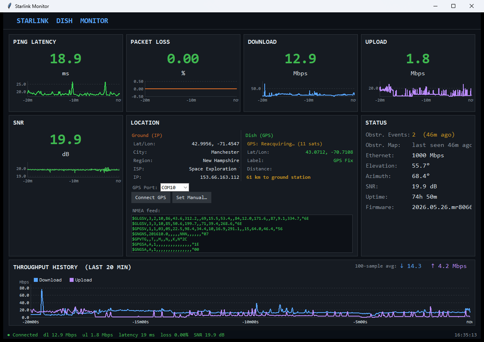

# Starlink Dish Monitor

A standalone Python GUI dashboard for monitoring a Starlink dish in real time.
It connects directly to the dish's **local gRPC API** — no Starlink app, SpaceX
login, or internet account required. Everything stays on your LAN.



The detail window adds dish pointing, tilt, per-sector signal quality, and an
optional "likely satellite" estimate:


---

## Features

**Main window**
- Live metric cards with sparklines: ping latency, packet loss, download, upload, SNR
- Throughput history chart (download + upload overlaid, 20-minute window)
  with a **100-sample moving-boxcar mean** for each stream
- **Status panel:** obstruction events (with age), Ethernet speed, boresight
  elevation/azimuth, SNR, uptime, firmware
- **Location panel** (two columns):
  - *Ground (IP)* — approximate ground-station/PoP location from public IP geolocation
  - *Dish (GPS)* — live dish position from an NMEA GPS receiver or manually-set coordinates
  - Haversine distance between dish and ground station
  - COM-port selector (auto-detect, remembers last port) and Connect / Set-Manual controls
  - **Live 5-line NMEA feed** — the raw serial sentences, auto-scrolling
- Every displayed value is selectable and copyable (Ctrl+C)
- Window text scales with window size; resize freely

**Detail window**
- Sky-position compass — boresight azimuth/elevation on a hemisphere
- Dish-tilt gauge — tilt from vertical, derived from the onboard orientation quaternion
- Per-sector signal quality — 10-segment radial ring chart
- Ready-states indicator — CADY / SCP / L1L2 / XPHY / AAP
- Dish info — hardware/firmware version, uptime, cumulative session data usage
- Extended info — country, GPS validity/accuracy, secondary beam, IDs, dish clock
- **Likely satellite estimate (optional)** — a checkbox under the sky compass
  downloads the public Starlink TLE catalogue from CelesTrak, propagates every
  satellite with SGP4, and reports whichever currently sits closest to the dish's
  reported boresight, with the angular offset (Δ). Requires a dish GPS fix (or
  manual coordinates) plus the optional `sgp4` + `numpy` packages. It is a
  best-guess — beam handoffs occur every ~15 s and several satellites can share a
  look-angle, and the dish never reveals the real satellite ID.

**Data logging**
- Every poll is appended to a CSV in `data/`, one file per UTC day
  (`data/starlink_YYYY-MM-DD.csv`), covering throughput, latency, loss, SNR,
  pointing, tilt, obstruction events, GPS, and more.

---

## Quick start

1. **Connect to your dish.** Join the Starlink Wi-Fi or plug into the router so the
   dish gateway `192.168.100.1` is reachable. Verify with `ping 192.168.100.1`.
2. **Install Python 3.9+** (developed and tested with **Python 3.11 on Windows 11**;
   the GUI uses `tkinter`, which ships with the standard python.org installer).
3. **Install dependencies:**
   ```bash
   pip install -r requirements.txt
   ```
4. **(Optional) Plug in a USB GPS** receiver that emits NMEA 0183 at 9600 baud and
   note its COM port.
5. **Run it:**
   ```bash
   python starlink_dashboard.py
   ```
6. The main window and a detail window open together. Closing the detail window
   just hides it; closing the main window exits the app.

No `protoc` step is needed — the protobuf schema is embedded in the script and
compiled automatically on first run.

---

## Requirements

| Component | Notes |
|---|---|
| Python 3.9+ | `tkinter` included; tested on 3.11 |
| `grpcio`, `grpcio-tools` | gRPC client + runtime proto compilation |
| `pyserial` | NMEA GPS over a serial COM port |
| `sgp4`, `numpy` *(optional)* | only for the "Likely satellite" TLE estimate |
| A Starlink dish | reachable at `192.168.100.1` over Ethernet or Wi-Fi |
| A USB GPS *(optional)* | any NMEA-0183 receiver as a serial COM port |

All of the above install via `pip install -r requirements.txt`.

---

## Configuration

Edit the constants at the top of `starlink_dashboard.py`:

| Constant | Default | Description |
|---|---|---|
| `DISH_HOST` | `192.168.100.1:9200` | Dish gRPC endpoint |
| `POLL_INTERVAL` | `2` | Status poll interval (seconds) |
| `HISTORY_LEN` | `600` | Sparkline buffer (600 pts × 2 s = 20 min) |
| `HIST_POINTS` | `600` | Throughput-history buffer (20 min) |
| `BOXCAR_N` | `100` | Sample window for the throughput moving mean |
| `SAT_MATCH_INTERVAL` | `15` | Seconds between TLE satellite matches |
| `GPS_PORT` | `COM10` | Default serial port for the GPS receiver |
| `GPS_BAUD` | `9600` | GPS baud rate |

The selected GPS port and any manually-entered dish coordinates are saved to
`location.json` (gitignored) and restored on next launch. Telemetry logs in
`data/` are also gitignored.

---

## How it works (build notes)

- **Transport.** The dish exposes an unauthenticated gRPC service on port 9200
  (`192.168.100.1:9200`). The client calls `Device.Handle` with `get_status` /
  `get_history` requests.
- **Schema.** The API is undocumented. The protobuf definitions live as a
  `PROTO_SRC` string inside `starlink_dashboard.py` and are compiled at runtime
  with `grpcio-tools` into a temp directory — so updating a field number is a
  one-line edit, no build step.
- **Field numbers** were reverse-engineered by raw wire-decoding against firmware
  **2026.05.26**; most telemetry fields sit ≈ `+1000` from the legacy
  community-documented spec.
- **Verified field-mapping corrections** (from wire captures on this firmware):
  - The history array at field `1010` is **not** SNR (it ranges ~16–89, mean ~32),
    so the SNR sparkline is built from live polls only rather than seeded with it.
  - `signal_stats` field 7 (once labelled "obstruction score") is an
    alignment/uncertainty metric, not an obstruction fraction — it swings between
    polls and reads high even with a clear sky, so it is logged raw but not shown
    as obstruction. Obstruction is surfaced via the event count + age instead.
- **GPS.** NMEA sentences are read on a background thread; `$xxGGA` gives fix
  quality + satellite count, `$xxRMC` gives the A/V status, and `*GSV` provides the
  in-view count. A fix auto-populates the dish coordinates.
- **IP geolocation** (via `ip-api.com`) resolves to the Starlink ground
  station / PoP, not the dish's physical location — this is expected.

---

## Disclaimer

This tool talks only to your own dish on your local network; it does not contact
SpaceX servers. Field numbers are empirical and may change with firmware. Use at
your own risk.
