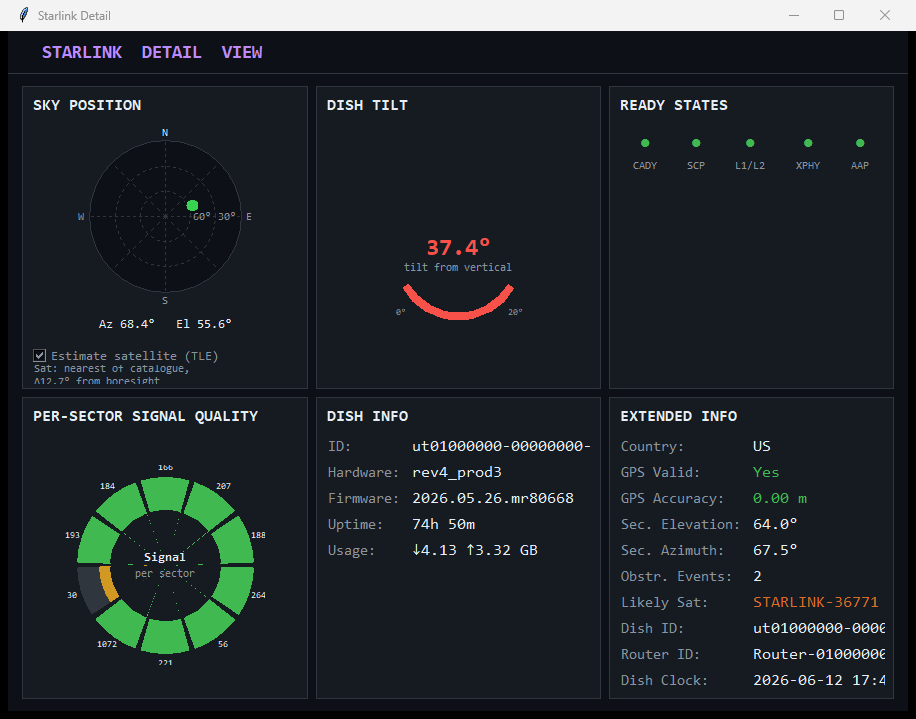

# From Conversation to Telemetry: A Second Case Study in Domain-Expert-Driven Code Generation, and a Test of the Domain-Expert Specification Schema

**Author:** A. McLeod
**Development assistant:** Claude (Anthropic), Claude Code
**Artifact:** `starlink-monitor` - <https://github.com/amcleodUNH/starlink-monitor>

---

## Abstract

This is a second case study in building a working tool by talking to a coding agent, and a chance to put a pattern from the first one to the test. The artifact is a standalone Python desktop dashboard that monitors a Starlink dish in real time over the dish's local gRPC interface, with live link metrics, a satellite sky map, GPS, on-disk logging, and a firmware guard; it was produced, as the prior project was, entirely by direction in plain language, with the human author writing none of the source. I am a marine instrumentation engineer, not a programmer. The unusual part is again a single class of non-obvious fact, only here it is sharper than a mislabeled protocol: the dish answers an undocumented gRPC API whose field numbers are shifted from the community-documented spec and, worse, several of its readings are actively misleading - a history buffer that looks like signal-to-noise but is not, a number that looks like an obstruction score but tracks something else, a panel that looks live but is frozen. None of this could be specified up front, because none of it was known; each was settled only by wire-decoding the raw bytes and checking the result against ground truth. "Validate your assumptions early." I treat the conversation as data a second time, condense roughly two dozen exchanges into a classified table, and then do something the first paper could only propose: I take the Domain-Expert Specification (DES) schema from that paper and ask whether it actually fits a different device, a different protocol, and a far larger artifact. It mostly does, with one honest seam I will name. I again put numbers on effort - a few hours of active attention against a three-point estimate near 40 person-hours for an unaided professional, and a different regime entirely for a non-programmer alone. One case again, observed and not controlled; the schema remains a hypothesis, now with a second data point rather than a proof.

**Keywords:** code generation, large language models, human-AI interaction, requirements specification, reverse engineering, protocol discovery, gRPC, satellite communications, end-user programming.

---

## 1. Introduction

The first paper in this small series described a field practitioner specifying an operational tool in plain language and an agent building, debugging, hardening, and publishing it. It ended with a proposal rather than a result: a seven-slot prompting schema, the Domain-Expert Specification, offered as a hypothesis about how people who know their gear but not their compiler could get to a correct artifact in fewer passes. A hypothesis with one supporting case is a story, not a finding. This paper adds a second case, deliberately chosen to be different in almost every dimension that matters - a different device, a network protocol that is documented but wrong rather than simply hidden, and an artifact perhaps three times the size - and asks whether the same division of labor and the same schema hold up when the work is bigger and the discovery is harder.

The setting is marine. A Starlink terminal is now the default over-the-horizon link on a working vessel or an uncrewed surface vehicle, and when the link degrades at sea you want to know why, locally, without an account login or a phone app that assumes a human is standing next to the dish. I asked for a tool that watches the dish on the local network and shows me what it is doing. What came back, after roughly two dozen turns spread over two sessions, was a published desktop application with a live link view, a moving map of the satellites overhead, a GPS feed, telemetry logging, and a guard that warns me when the dish updates its own firmware out from under the field mappings the tool depends on. My aims are the two from before. Record the artifact honestly, including the part that was genuinely hard. Then read the transcript as evidence, and this time hold it up against the schema the last paper proposed, to see what survives contact with a second case.

---

## 2. The dish, and the telemetry it does not document

A Starlink terminal exposes a gRPC service on its local gateway, `192.168.100.1`, port `9200`, with no authentication. That much is community knowledge. The trap is in the details, and it has two layers.

The first layer is ordinary reverse engineering. The service is undocumented by SpaceX, and the field numbers that community tools once relied on no longer match: in the firmware this dish runs, the telemetry fields sit roughly a thousand higher than the legacy spec, and they are not stable across firmware. So the agent rebuilt the schema from the wire. It compiled a protobuf definition at runtime from a string embedded in the program, called the status and history methods, serialized the replies back to bytes, and walked the wire format by hand - field number, wire type, value - until each reading lined up with something physical. Tedious, but mechanical. Off-the-shelf field maps do not survive a firmware bump; a decoder does.

The second layer is the one I want to dwell on, because it is the project's real lesson and it is worse than a hidden protocol. Several of the dish's readings are not hidden at all. They are present, plausible, and wrong, and only watching them over time or against an independent truth exposes them:

- A packed history buffer decodes cleanly as floating-point numbers in a believable range, and the obvious reading is "signal-to-noise history." It is not. Watched against the live SNR the dish streams (steady near 16 to 20 dB), the buffer ran from 16 to 89 with a mean around 32. An SNR of 89 dB is not a thing. The buffer is some other quantity; seeding the SNR chart from it was quietly showing fiction, and the only way to catch it was to put the buffered series next to the streamed one and notice they did not agree.
- A field decodes as a tidy number between 0 and 1 and sits exactly where you would expect an "obstruction score." Reported as one, it made no sense: it read high while the sky was provably clear, and it swung from 0.62 to 0.44 between two polls seconds apart. Real obstruction does not do that. It is an alignment or uncertainty metric wearing an obstruction's clothes; the genuine obstruction signal lives elsewhere and, on this firmware, the boolean that ought to carry it is itself unreliable, reading "obstructed" under an open sky.
- A ten-value array looked like a live per-sector signal map. It never moved. Polled eight times across fourteen seconds while throughput and SNR changed normally, it returned byte-for-byte identical values every time. The array is real, but it is a slowly-accumulated sky scan that shifts over hours, not a per-second reading. Captured once and ignored? No. Read every poll, redrawn every poll, and simply constant at the source. The fix was not code; it was relabeling the thing as what it actually is.

I dwell on these because they are the heart of the matter. A hidden protocol you can find by trying harder. A reading that is present and lies to you, you can only catch by distrusting it - by setting it beside a streamed value, or a clear sky, or the same field one poll later, and watching for the contradiction. I could not have told the agent any of this up front. I did not know it, and the published field maps did not either. It had to be discovered, by probing the box and refusing to believe the first plausible answer, and discovery of that kind is a capability no wording on my end can supply.

---

## 3. The artifact

The result is a single Python file, `starlink_dashboard.py`, that runs on the standard library plus the gRPC runtime, with two optional packages (`sgp4` and `numpy`) used only by the satellite features and degraded gracefully when absent. One file keeps deployment on a vessel's console painless, which is the same instinct that drove the previous project's zero-dependency choice.

It does several jobs at once. A client layer speaks the dish's gRPC dialect: it compiles the embedded protobuf at runtime - no build step, so a field map can be corrected with a one-line edit and a relaunch - polls status every two seconds on a background thread, and marshals results to the interface safely. A main window shows the live link: download and upload, latency, packet loss, and SNR, each with a rolling sparkline, a twenty-minute throughput history with a hundred-sample moving mean, a status panel, and a location panel that pairs an IP-derived ground-station estimate with the dish's own GPS position, a distance between them, and a live scroll of the raw NMEA sentences off a serial GPS. A detail window adds a satellite sky map: a top-down, dish-centered map drawn with real coastlines and state and country borders, every Starlink satellite's ground point plotted from public two-line elements and propagated with SGP4 so the field moves in real time, the dish's most-likely satellite highlighted with a line to it, a fixed-scale view, a range ring, and a north indicator (Figure 1). Below it sit a per-sector map, a plain-language readout of the dish's subsystem-ready flags, dish information including the firmware version and tilt, and an extended-info panel. Every poll is appended to a daily CSV, schema-versioned so a new column never corrupts a day's file. And a firmware check compares the dish's reported build against the one the field mappings were verified on, turning the panel amber with a warning on a mismatch while continuing to run.

*Figure 1. The detail window, with the dish-centered satellite sky map at top.*

That last feature earned its keep during the project, which I will return to in §4.

---

## 4. The interaction as method

The tool came together over roughly two dozen user turns across two working sessions. Table 1 condenses the significant ones and labels each by what it was doing, using the same taxonomy as the first paper: *specification* (states a requirement), *authorization* (grants permission), *defect report* (flags a fault), *feature* (adds scope), *packaging* (distribution and structure), *deferral* (marks a value as later-bound), *context* (supplies domain framing), and *constraint* (bounds how the work is done). I have folded a number of small layout and packaging turns into the rows below; the full transcript is longer than the table.

**Table 1. The development interaction, by turn (condensed).**

| # | User input (condensed) | Function | Elicited |
|---|------------------------|----------|----------|
| 1 | Starlink dish at 192.168.100.1; find the debug interface and build a monitoring dashboard | Specification | Initial system; gRPC API and field-number discovery |
| 2 | Add a COM-port selector for the GPS, default COM10 | Feature | Serial GPS source selection |
| 3 | The "obstructed" value reads true under a 100% clear sky; confirm and correct | Defect report | Discovery: the obstruction boolean is unreliable on this firmware |
| 4 | Are the dish nickname and data-usage values available locally? | Specification (inquiry) | Confirmed server-side only; not in the local API |
| 5 | Make the project portable and publish it to GitHub | Packaging | Repository, README, license, .gitignore |
| 6 | Make values copyable, enlarge fonts, fix obscured sky data, age the obstruction events | Feature + defect | Usability and layout corrections |
| 7 | Recode against the Starlink V2 service-account API (client id and secret supplied) | Specification | Discovery: the credential is consumer-scoped and cannot reach the telemetry API |
| 8 | Abandon that approach; delete the tokens | Constraint | Reverted to the local API; secret handling |
| 9 | Add a "likely satellite" estimate from TLE data | Feature | CelesTrak TLE plus SGP4 look-angle matching |
| 10 | Panel text does not scale and gets masked by other panels; fix within reason | Defect report | Window-scaled fonts; Location panel rebuilt |
| 11 | The buffered SNR is far higher than the streamed value; confirm the right data is used. The obstruction score makes no sense, high under a clear view | Defect report | Discovery: history field is not SNR; signal field is not obstruction |
| 12 | Add a live, scrolling NMEA feed box | Feature | Raw serial sentences on screen |
| 13 | Make the ready-states panel descriptive; the acronyms are not obvious | Feature (usability) | Plain-language subsystem labels |
| 14 | Add a firmware-version check; alert on a mismatch but keep running | Reliability | Firmware guard (later caught a real over-the-air bump) |
| 15 | The per-sector values never change; are they captured once and ignored? Also log them | Defect report + Feature | Discovery: the array is a slow sky-scan map; logged for study |
| 16 | Build a moving sky map from the TLE data around the dish, with a background map, and highlight the likely sat | Feature | Dish-centered satellite map with real borders |
| 17 | Turn the project into a Claude Project; bundle the chats and code | Packaging (meta) | Knowledge bundle; secret redaction |
| 18 | Write this paper | Meta | The present document |

Three turns deserve a closer look, because they fall on the line the first paper drew: the difference between a defect of specification and a defect of implementation or knowledge.

**Turn 11, a knowledge defect surfaced by distrust.** I told the agent the SNR chart "appeared to lock up" and, later, that the obstruction score "makes no sense" against a clear sky. Neither report was clever, and neither needed to be. They were the judgment I do have: the picture on the screen disagreed with the weather and with the live number beside it. From those two complaints the agent went back to the wire, put the buffered series next to the streamed SNR, polled the obstruction field repeatedly and watched it swing, and concluded that both fields had been mismapped - not by us alone, but by the community spec it inherited. This is the analog of the previous project's hidden Modbus dialect, and it is irreducible in the same way: it rode on runtime evidence nobody had until the box was watched. What I supplied was not the answer but the suspicion, and the suspicion is exactly what a domain expert carries. I know what a clear sky looks like.

**Turn 14, reliability that the field then exercised for real.** I asked for a firmware check: compare the dish's build to the one the mappings were verified against, warn on a mismatch, keep running. A sensible guard, written against a hypothetical. Days later the hypothetical happened - the dish updated itself over the air, from one build to a newer one - and the guard did precisely its job: it turned the firmware line amber, posted the warning, and kept running while I checked that the readings still agreed with reality. They did, so we promoted the new build to "known" and moved on. I like this turn because the requirement came from the destination rather than from a present bug: a dish in the field updates on its own schedule, and a tool that silently trusts stale field numbers will lie to you the day that happens. Stating that as a requirement on day one was possible. I did not, but I could have.

**Turn 7, a specification that hit a wall the agent diagnosed.** I asked, mid-project, to rebuild the whole thing against Starlink's V2 service-account API, and handed over a client id and secret. The agent took the credential, authenticated, and then found that the token it minted was scoped to the consumer tier and could not reach the telemetry endpoints at all - every enterprise route refused it. So the answer to "recode against the cloud API" turned out to be "you cannot, with this credential," established empirically and quickly, and we reverted. Two things are worth noting. The dead end was found by trying, not by guessing. And the agent, unprompted, kept the secret out of the source and out of the public repository and later flagged that it should be rotated, which is the kind of safety reflex I want and would not reliably have specified.

---

## 5. Reading the inputs: what could have been said sooner

The central question repeats. Of the turns in Table 1, which supplied something that was latent in my first intent and could have been hoisted into the opening pass, and which were genuinely irreducible?

**The irreducible ones.** Turn 1 (the seed) and turn 18 (this paper) are required by definition. Turn 11's discovery - that two fields were mismapped - could only surface once the artifact existed, ran, and was watched against ground truth; no wording could have pre-empted a fact nobody held. The same is true of the protocol work behind turn 1, and of the cloud-API dead end in turn 7, which rode on the runtime fact that the credential was the wrong tier. These are discovery, and discovery is the agent's to do.

**The avoidable ones.** A familiar list of turns each named something that was in my intent from the start but only got said once its absence was in front of me. The GPS source and feed (turns 2, 12) were always part of "monitor the dish on a vessel," where position and a serial GPS are routine. The satellite map (turns 9, 16) was where "see what the dish is doing" was always heading; the opening request said only "a dashboard." Publishing, packaging, and the knowledge bundle (turns 5, 17) were the intended destination, not an afterthought. And the firmware guard (turn 14) follows directly from the deployment: a dish in the field updates itself, so a tool that depends on firmware-specific field numbers must notice when the firmware changes. That could have been a non-functional requirement on day one.

**A single-pass reconstruction.** Fold the realized intent back into the seed and you get a request that, setting aside the irreducible discovery, could have produced substantially the final artifact in far fewer passes:

> *Build a standalone, publishable desktop tool to monitor a Starlink dish over its local gRPC interface at 192.168.100.1, for use on a vessel or an uncrewed surface vehicle. I am not a programmer; deliver a single self-contained program I can run with minimal setup. Show the live link - throughput, latency, loss, SNR - with short histories, the dish's pointing and obstruction state, its GPS position from a serial NMEA receiver with the raw feed visible, and a map of the satellites overhead derived from public orbital elements, with the likely connected satellite highlighted. Log everything to disk for later study. The dish is undocumented and updates its own firmware in the field, so determine the telemetry field numbers empirically rather than trusting any published map, distrust any reading that disagrees with physical reality, and warn me - without stopping - when the firmware changes out from under those mappings. Where I supply a credential or a value, treat it as sensitive and keep it out of the published repository. Package it as its own public GitHub repository with a README, an open-source license, and screenshots.*

I offer this, as before, not as a reproach to how the real conversation went. Discovering your own requirements as you go is normal and often efficient, and a few of these I genuinely could not have judged before an artifact made the trade-off concrete. I offer it as evidence that a sizable share of the turns were latent in the first intent, and so, in principle, could have been moved to the front.

---

## 6. The Domain-Expert Specification schema, applied to a second case

The first paper proposed the DES schema and could only argue that it would have helped. Here I can do better: apply it after the fact to a genuinely different project and see where it fits and where it strains. The schema has seven slots; I take them in turn, with this project's content, and grade each.

1. **Device and interface.** A Starlink dish, reached over Ethernet at `192.168.100.1` on the local network, speaking gRPC. *Fits cleanly. I knew the address and the transport precisely, and naming them pointed the agent straight at the right surface; the protocol hunt was bounded from the first line.*
2. **Operational repertoire.** Watch the link metrics, the pointing and obstruction state, the GPS position, the satellites overhead; log it; survive a firmware change. *Fits, and it is again the slot I under-filled - the satellite map and the logging were latent, not stated. It is also again the slot I am best placed to fill completely, because it is just the watch-standing I want written down.*
3. **Field context and deployment.** A vessel or an uncrewed surface vehicle, an over-the-horizon link that matters operationally and degrades without warning. *Fits, and it does real work: "the dish updates itself in the field" is a deployment fact, and it licenses the firmware guard of turn 14 as a non-functional requirement.*
4. **Authorization and safety envelope.** Here is the first strain, and it is instructive. In the previous project this slot meant "you may switch the relays, nothing is connected." Here the dish is live and load-bearing, so there was nothing to authorize - reads are safe and writes were never in scope. The slot did not so much fail as fall idle. *Mostly not applicable to a read-only instrument; the safety envelope that did matter was about my data, not the device, which slot 4 does not quite name (more on this below).*
5. **Deferred parameters.** The known firmware build, and earlier the GPS port, were values that change with the hardware in front of you. *Fits. Naming the firmware build as a verified-against constant, rather than a hard assumption, is exactly the deferral slot 5 is for, and it is what made the firmware guard possible instead of a silent breakage.*
6. **Deliverable and distribution.** A single runnable program in its own public, documented repository, released and packaged. *Fits, and stating it first would again have collapsed several packaging turns into the opening pass.*
7. **Verification expectation.** Verify against reality - the streamed value, the clear sky, the same field one poll later - and, where ground truth is thin, against an independent model. *Fits, and it is the slot that earned the most here. The satellite math was checked against an independent ephemeris library to a fraction of a degree; the mismapped fields were caught precisely by holding a reading against a streamed truth. This slot turns "make it work" into "show me it agrees with the world," which is the whole game when the device's own readings cannot be trusted.*

So six of seven slots transfer to a very different project without modification, which is more than I expected, and the schema's core refusal - do not ask the user for implementation - held: I specified no field numbers, no projection math, no threading model, and those are exactly the parts that had to be discovered or engineered. The one seam is slot 4. On a read-only instrument the device-authorization framing goes slack, while a different safety concern - the handling of a credential I pasted into the conversation - turned out to matter and is not what slot 4 was built to capture. The agent handled it correctly on its own reflexes, keeping the secret out of the repository and advising rotation, but the schema did not prompt me to state it. I will not bolt on an eighth slot from one case. I will note the gap: as soon as a domain expert hands an agent anything sensitive - a token, a key, a position - there is a data-handling expectation that belongs in the specification, and slot 4 should probably be read more broadly than "what may you do to the device" to "what is the safety envelope, for the device and for my data both."

---

## 7. How long it took, and how long it might otherwise have taken

As before, I treat duration as effort in person-hours, not calendar time. The project's wall-clock span ran across two sessions over several days, but most of that was idle stretches waiting on my own availability, my own review, and, more than once, the dish dropping off the network and coming back. Effort is the quantity worth comparing.

### 7.1 Method

For the AI-coupled side I bound active effort from the record. The work landed across roughly two dozen short turns and the agent's bounded replies, with version-control timestamps showing increments minutes apart and a string of tagged releases, v1.0.0 through v1.0.5, marking the larger steps. This project was materially bigger than the first and ran longer, with more iteration and a great deal of live verification against a real dish. Active effort - agent generation plus my own reading and direction - comes to a few hours, call it three to four. I report it as an order-of-magnitude figure and round up on purpose, preferring to overstate the human-side cost of reviewing output than to understate it.

For the unaided side there is again nothing to measure, so I estimate it. I break the artifact into nine components, give each a three-point estimate (optimistic *a*, most-likely *m*, pessimistic *b*), and apply the PERT approximation: expected effort *t*ₑ = (*a* + 4*m* + *b*)/6, with standard deviation *σ* = (*b* − *a*)/6, treating the components as independent so the total variance is the sum of the component variances. The baseline assumes a competent professional developer, which is generous given that the person who actually directed the work calls himself a non-programmer. Scope matches what was delivered: discovery, the satellite and mapping work, verification, reliability, and packaging are all in, not just the happy path.

### 7.2 Result

**Table 2. Three-point (PERT) effort estimate for an unaided professional build.** All values in person-hours.

| Work component | *a* | *m* | *b* | *t*ₑ | *σ* |
|----------------|----:|----:|----:|-----:|----:|
| API and protocol discovery (gRPC, runtime proto, field-number map, catch mismapped fields) | 3.0 | 8.0 | 20.0 | 9.17 | 2.83 |
| gRPC client and embedded runtime-compiled proto | 1.0 | 3.0 | 6.0 | 3.17 | 0.83 |
| Core GUI (cards, sparklines, history, layout, window scaling) | 3.0 | 6.0 | 12.0 | 6.50 | 1.50 |
| GPS (NMEA serial parse, IP geolocation, persistence) | 1.5 | 3.5 | 7.0 | 3.75 | 0.92 |
| Satellite estimate and sky map (SGP4 sub-points, geodetics, vector borders, projection, animation) | 3.0 | 7.0 | 15.0 | 7.67 | 2.00 |
| Data logging and schema-safe rotation | 0.5 | 1.5 | 3.0 | 1.58 | 0.42 |
| Reliability (threading, reconnect, firmware guard) | 1.0 | 2.5 | 6.0 | 2.83 | 0.83 |
| Testing and verification (headless tests, ephemeris cross-check) | 1.0 | 3.0 | 7.0 | 3.33 | 1.00 |
| Packaging and publishing (repo, README, six releases, screenshots) | 1.0 | 2.0 | 5.0 | 2.33 | 0.67 |
| **Total** | | | | **40.3** | **4.3** |

The components add up to an expected 40.3 person-hours with a standard deviation of 4.3 h (the total *σ* is the root-sum-square of the component values); a normal approximation puts a 90% interval at roughly 33 to 47 hours, about a working week. The largest and shakiest lines are the two discovery-heavy ones: an unaided developer, without a quick probe-decode-and-distrust loop, has to work out on their own both that the field numbers have moved and, harder, that several plausible readings are lying, the same facts the agent established empirically in §2.

### 7.3 Comparison

Against that baseline, the AI-coupled work produced a tested, published, six-release artifact in a few hours of active effort, an effort reduction on the order of ten-fold relative to an unaided professional - a smaller multiple than the first project's, and I think honestly so, because this artifact is larger and more of its bulk is ordinary interface and mapping code that a professional writes briskly. The comparison against my actual alternative is the same as before and sharper for being unquantifiable: I am not a developer. For me, building this unaided does not start at 40 hours; it starts with acquiring gRPC, protobuf wire formats, orbital mechanics, serial parsing, threading, and desktop UI before the real work begins, and its honest outcomes are some large multiple of the professional estimate or, more likely, non-completion. The operative comparison for someone like me is not "a few hours versus forty." It is "a working tool versus none."

### 7.4 Threats to validity

The AI-coupled figure is an uninstrumented order-of-magnitude bound; the unaided figure is a modeled estimate, not a measurement, and three-point estimates drift with whatever the estimator anchors on. Both rest on n = 1, now alongside a second n = 1 rather than aggregated with it. The professional baseline could be conservative or generous depending on how much gRPC and orbital work the developer brings already; I widened the pessimistic discovery bounds to absorb some of that. And the ratio from one small instrument should not be stretched to large systems, where architecture and years of maintenance dominate and a conversation will not carry you. These figures describe single-purpose field instrumentation, where the method looks most advantageous, and not much beyond.

---

## 8. Discussion

The same division of labor showed up, and the second case strengthens it. The practitioner brings the *what* and the *why*: the device, the watch I want to stand, where it is going, what "done" looks like, and the suspicion that a reading is wrong. The agent brings the *how*: the protocol framing, the orbital math, the interface, the threading - and, just as much, the *discovery* of facts that can only be learned at runtime, including the uncomfortable ones where the device's own telemetry misleads. Every correction that no specification could have prevented - the moved field numbers, the two mismapped readings, the frozen sky-scan array, the wrong-tier credential - fell on the agent's side of that line, which is where the schema's refusal to ask users for implementation would put them.

What the second case adds is a test of the schema rather than another argument for it, and the test came back mostly positive with one named seam. Six of seven slots transferred unchanged to a different device and a far larger artifact, and the verification slot in particular did heavy lifting precisely because this device's readings could not be taken at face value. The seam was slot 4: device-authorization went idle on a read-only instrument while a data-handling concern I did not anticipate - a credential in the conversation - turned out to matter, was handled well by the agent unprompted, and was not something the schema prompted me to state. That is a real finding from a real difference between the cases, not a flaw I went looking for.

The honesty caveats from the first paper still apply and one is sharper here. This is again n = 1, with no control and a user-and-agent pair I cannot claim is representative. Some apparent under-specification is again good practice; I could not have judged the need for a firmware guard's exact behavior before watching the field numbers' fragility, even if I could have named the requirement. And the schema leans hard on an agent that can actually do empirical discovery and distrust its own first reading - against a weaker system, slots 4 and 7 would give back much less, and the very thing that made this project work, refusing to believe a plausible number, is not something every tool will do.

Future work is the same head-to-head I called for before, now with two grounding cases instead of one: paired tasks with and without the structured prompt, across several domain users and devices, measuring turns to acceptance, defect counts, instrumented time against matched unaided controls, and the share of corrections that trace to specification gaps versus discovery. With two cases pointing the same way, that study is more worth running, not less.

---

## 9. Conclusion

A field practitioner produced, debugged, hardened, and published a second operational device-monitoring application by conversation alone, leaning on domain knowledge rather than programming skill - this time against a device whose telemetry is not merely undocumented but, in places, actively misleading. The interaction compressed development effort by roughly an order of magnitude against an estimated unaided professional baseline, and for a non-programmer it again plausibly made the difference between a working tool and none. Reading the transcript back, the now-familiar split held: about half the turns supplied requirements latent in the original intent and could have been hoisted into a single pass, while the irreducible minority - the moved fields, the readings that lied, the wrong-tier credential - were discovery, and properly the agent's to carry. Most usefully, I could finally test the Domain-Expert Specification schema rather than only propose it, and six of its seven slots transferred to a markedly different project intact, with the one seam - a safety envelope for my data, not just the device - named honestly for the next revision. Two cases are not a validation. They are a second data point pointing the same direction as the first, which is reason enough to keep asking the question with proper controls, and to keep handing the discovery to the side that can actually do it.

---

### Materials and reproducibility

The complete artifact, including the runtime-compiled gRPC client, the two-window interface, the satellite sky map, and the figure reproduced here, lives at <https://github.com/amcleodUNH/starlink-monitor> under the MIT License, across tagged releases v1.0.0 through v1.0.5. The telemetry field mappings were established by wire-decoding the dish's own replies and were verified against the firmware build named in the application's `KNOWN_FIRMWARE` constant; the satellite look-angle math was cross-checked against an independent ephemeris library to within a fraction of a degree, and the mismapped fields described in §2 were identified by holding a decoded reading against a streamed value, a physically clear sky, or the same field on a later poll.

### A note on authorship

The software artifact and a draft of this paper were generated by an LLM coding agent (Claude, Anthropic) under the direction of the human author, whose inputs - reproduced and analyzed in §4 and §5 - were the specification. Most of the typing was not mine. The paper's self-referential reading of those inputs, and its grading of a schema the author co-proposed in the prior case, should be taken with that provenance in mind.
